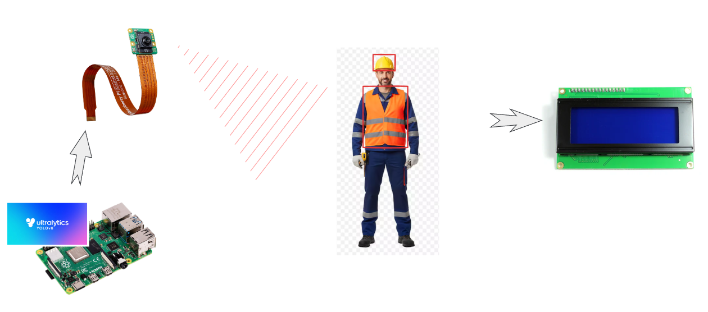
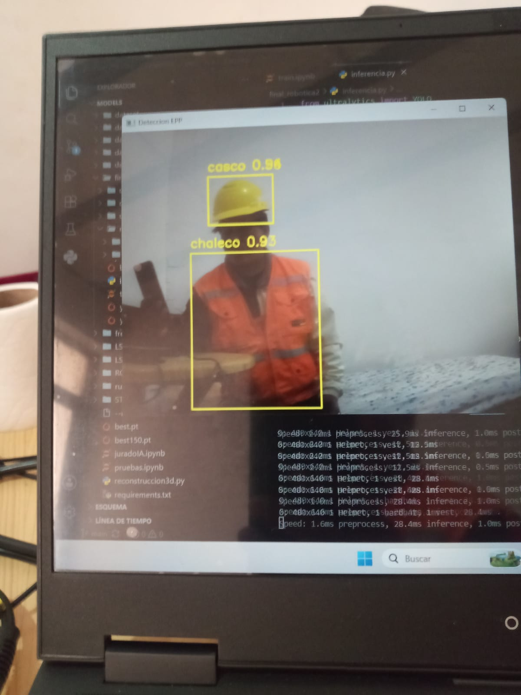
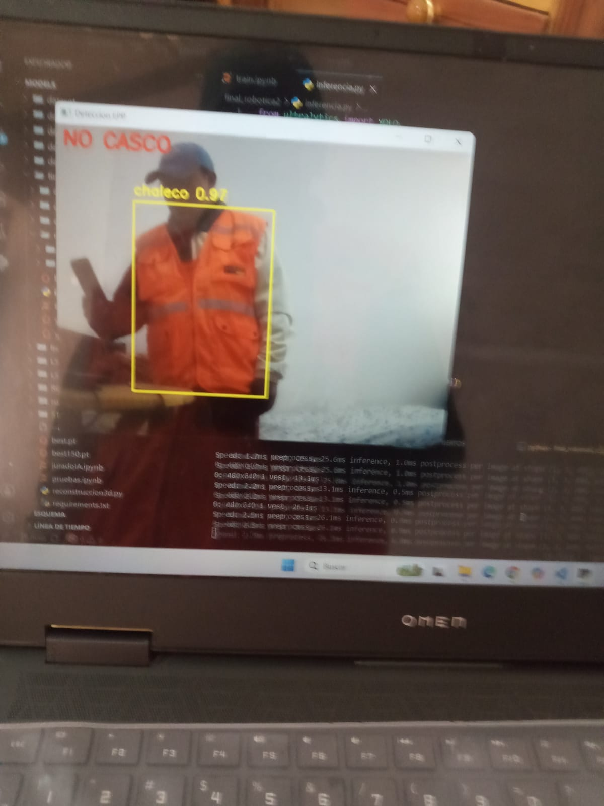
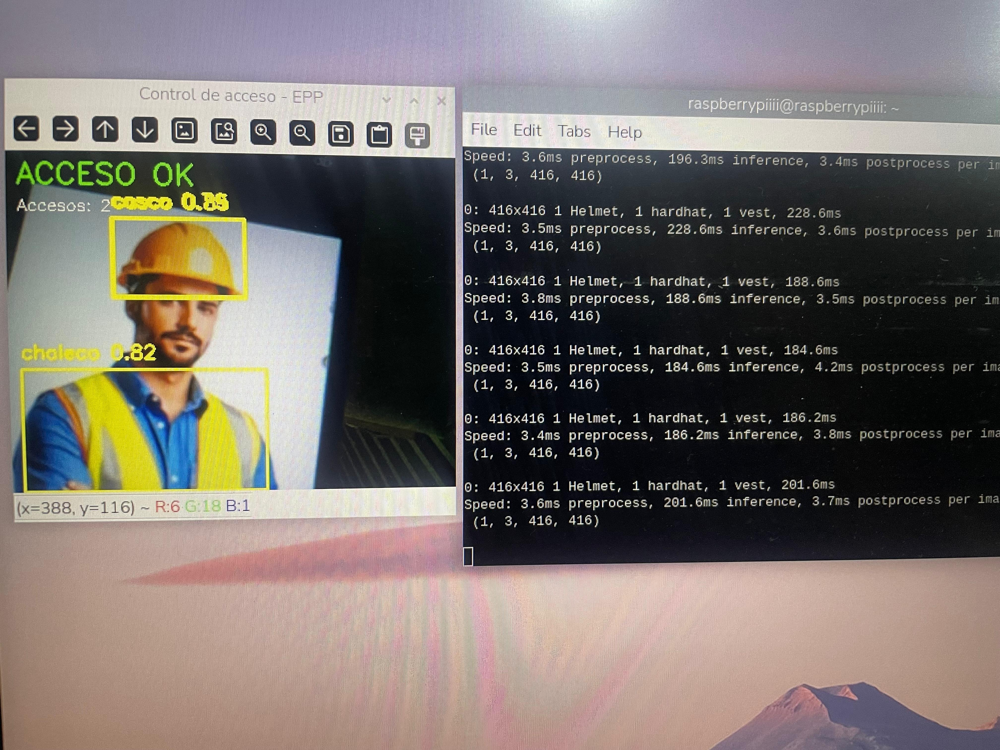
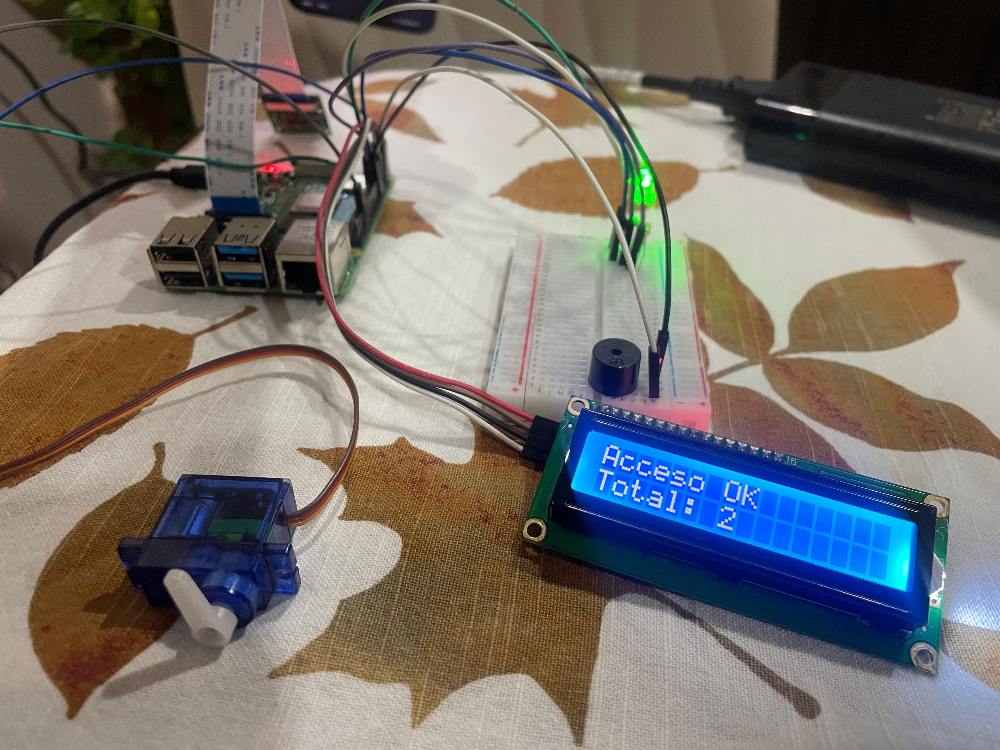
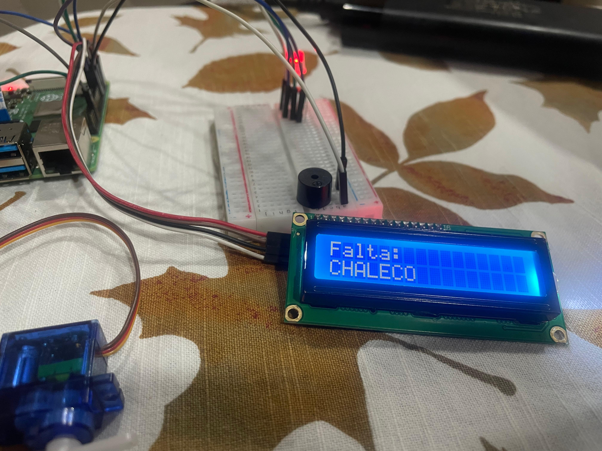
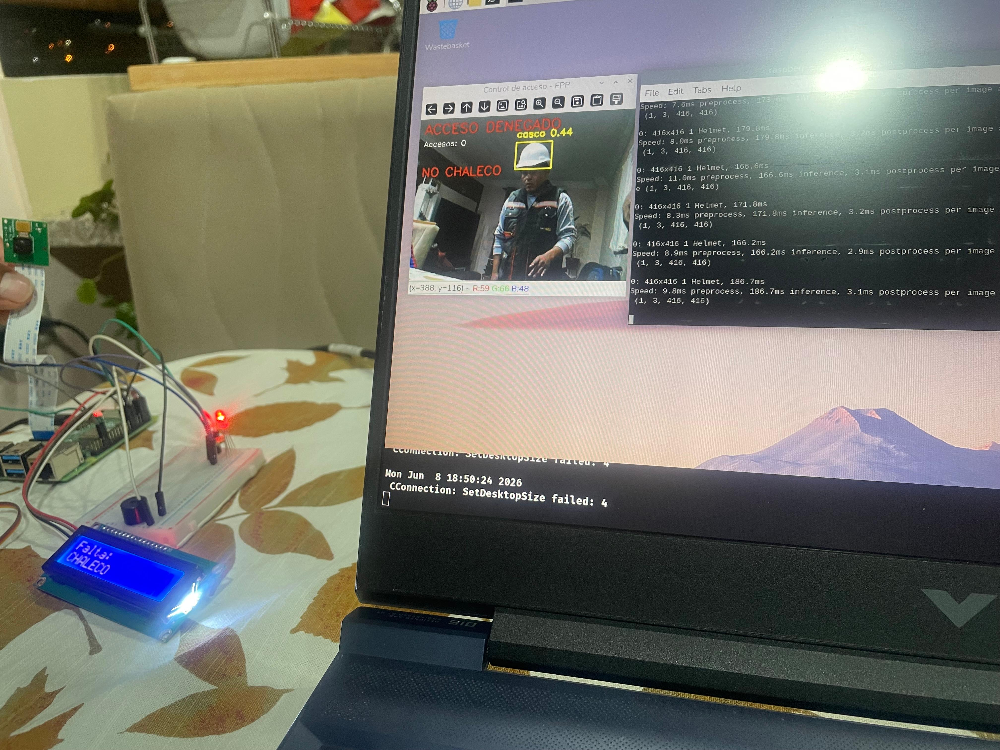

# 🦺 Sistema Inteligente de Control de Acceso mediante Detección de EPP con YOLOv26 y Raspberry Pi


## 📖 Descripción

Sistema embebido de visión artificial para el control automatizado de acceso mediante la verificación en tiempo real del uso correcto de Equipos de Protección Personal (EPP).

El proyecto utiliza una Raspberry Pi 4 Model B, una cámara de captura de video y un modelo de detección de objetos YOLOv8 entrenado para identificar elementos de seguridad como cascos y chalecos reflectantes.

Cuando un trabajador se presenta frente a la cámara, el sistema analiza la imagen y determina si cumple con los requisitos de seguridad establecidos. Si porta todos los elementos obligatorios, se autoriza el acceso; en caso contrario, se genera una alerta visual y sonora indicando los elementos faltantes.

---

# 🎯 Objetivos

## Objetivo General

Desarrollar un sistema inteligente capaz de verificar automáticamente el uso adecuado de Equipos de Protección Personal mediante técnicas de visión artificial e inteligencia artificial.

## Objetivos Específicos

* Detectar EPP en tiempo real utilizando YOLOv26.
* Automatizar el control de acceso a zonas restringidas.
* Reducir errores asociados a la supervisión manual.
* Proporcionar retroalimentación inmediata al usuario.
* Implementar una solución de bajo costo basada en hardware embebido.

---

# 🖼️ Capturas del Proyecto

## Sistema Completo



```markdown

```

---

## Detección de EPP en Tiempo Real




```markdown

```

---

## Acceso Permitido




```markdown

```

---

## Acceso Denegado




```markdown

```

---

# ⚙️ Funcionamiento General

1. El trabajador se posiciona frente a la cámara.
2. Se captura un fotograma en tiempo real.
3. YOLOv8 detecta los EPP presentes.
4. El sistema verifica los elementos obligatorios.
5. Si cumple los requisitos:

   * LED RGB verde.
   * Apertura de puerta mediante servomotor.
   * Incremento del contador de accesos.
6. Si faltan elementos:

   * LED RGB rojo.
   * Activación del buzzer.
   * Mensaje en LCD indicando los EPP faltantes.
   * Acceso bloqueado.

---

# 🏗️ Arquitectura del Sistema

## Arquitectura Física

```text
                     ┌──────────────┐
                     │    Cámara    │
                     └──────┬───────┘
                            │
                            ▼
                 ┌─────────────────────┐
                 │ Raspberry Pi 4      │
                 │ YOLOv8 + OpenCV     │
                 └──────┬──────────────┘
                        │
        ┌───────────────┼────────────────┐
        │               │                │
        ▼               ▼                ▼
    LED RGB         LCD 16x2         Buzzer
        │
        ▼
   Servomotor
        │
        ▼
 Apertura Puerta
```

---

# 💻 Arquitectura del Software

El sistema fue diseñado utilizando una arquitectura modular para facilitar el mantenimiento, escalabilidad y reutilización del código.

## Módulos Principales

### 📷 Módulo de Captura

Responsabilidades:

* Inicializar la cámara.
* Capturar fotogramas.
* Entregar imágenes al detector.

Archivo:

```text
camera.py
```

---

### 🤖 Módulo de Detección

Responsabilidades:

* Cargar el modelo YOLOv8.
* Realizar inferencias.
* Obtener clases detectadas.

Archivo:

```text
detector.py
```

---

### ✅ Módulo de Validación

Responsabilidades:

* Comparar elementos detectados.
* Determinar EPP faltantes.
* Autorizar o rechazar acceso.

Archivo:

```text
validator.py
```

---

### 🔌 Módulo de Hardware

Responsabilidades:

* Control del LED RGB.
* Activación del buzzer.
* Manejo del servomotor.
* Comunicación con LCD.

Archivo:

```text
hardware_controller.py
```

---

### 🚀 Módulo Principal

Responsabilidades:

* Integración de todos los módulos.
* Gestión del flujo principal.
* Coordinación del sistema.

Archivo:

```text
main.py
```

---

# 📁 Estructura del Proyecto

```text
Proyecto-EPP/
│
├── models/
│   └── best.pt
│
├── src/
│   ├── camera.py
│   ├── detector.py
│   ├── validator.py
│   ├── hardware_controller.py
│   └── main.py
│
├── dataset/
│
├── docs/
│
├── images/
│
├── requirements.txt
│
└── README.md
```

---

# 📚 Bibliotecas Utilizadas

| Biblioteca  | Función                          |
| ----------- | -------------------------------- |
| Ultralytics | Implementación de YOLOv8         |
| OpenCV      | Procesamiento de imágenes        |
| NumPy       | Operaciones matemáticas          |
| RPi.GPIO    | Control GPIO                     |
| gpiozero    | Gestión simplificada de hardware |
| smbus2      | Comunicación I2C                 |
| Pillow      | Procesamiento de imágenes        |
| Python      | Lenguaje principal               |

---

# 🔧 Instalación

## 1. Clonar repositorio

```bash
git clone https://github.com/ariel101/final-project-cv.git

cd final_project-cv
```

---

## 2. Crear entorno virtual

Linux:

```bash
python3 -m venv venv

source venv/bin/activate
```

Windows:

```bash
python -m venv venv

venv\Scripts\activate
```

---

## 3. Instalar dependencias

```bash
pip install -r requirements.txt
```

---

# ⚙️ Configuración

## Modelo Entrenado

Copiar el modelo entrenado dentro de:

```text
models/
```

Ejemplo:

```text
models/best.pt
```

---

## Configuración GPIO

Modificar los pines según la conexión física utilizada:

```python
LED_VERDE = 17
LED_ROJO = 27
BUZZER = 22
SERVO = 18
```

---

# ▶️ Ejecución

Ejecutar:

```bash
python src/main.py
```

El sistema iniciará:

* Cámara
* Modelo YOLOv26
* Detección en tiempo real
* Validación de EPP
* Control de acceso

---

# 🧠 Fragmentos de Código Importantes

## Carga del Modelo

```python
from ultralytics import YOLO

model = YOLO("models/best.pt")
```

Este fragmento carga el modelo entrenado responsable de la detección de los Equipos de Protección Personal.

---

## Inferencia en Tiempo Real

```python
results = model(frame, conf=0.5)

for result in results:
    for box in result.boxes:
        clase = int(box.cls[0])
        confianza = float(box.conf[0])
```

Permite analizar cada fotograma capturado y obtener las clases detectadas junto a su nivel de confianza.

---

## Verificación de Elementos Obligatorios

```python
required_items = ["helmet", "vest"]

missing = [
    item for item in required_items
    if item not in detected_items
]
```

Compara los elementos detectados contra la lista de EPP obligatorios para determinar si el acceso puede ser autorizado.

---

## Control de Acceso

```python
if len(missing) == 0:
    open_door()
    green_led()
else:
    red_led()
    activate_buzzer()
```

Implementa la lógica principal de autorización o rechazo de ingreso.

---

## Actualización de LCD

```python
message = "Falta: " + ", ".join(missing)

lcd.clear()
lcd.write_string(message)
```

Muestra al usuario los elementos de seguridad faltantes.

---

# 🔌 Componentes de Hardware

* Raspberry Pi 4 Model B
* Cámara USB / Raspberry Pi Camera
* Pantalla LCD 16x2 I2C
* Servomotor SG90
* Buzzer
* LED RGB
* Fuente de alimentación 5V
* Cables Dupont

---

# 📈 Resultados Esperados

* Detección automática de EPP.
* Monitoreo en tiempo real.
* Control automatizado de acceso.
* Reducción de errores humanos.
* Incremento del cumplimiento de normas de seguridad.

---

# 🚀 Mejoras Futuras

* Reconocimiento facial.
* Registro de accesos en base de datos.
* Dashboard web.
* Estadísticas de uso.
* Integración con sistemas industriales.
* Almacenamiento de evidencias fotográficas.
* Notificaciones mediante Telegram o correo electrónico.

---

# 👨‍💻 Autores

**Nombre del Estudiante 1**

**Nombre del Estudiante 2**

**Universidad / Carrera**

**Gestión 2026**

---

# 📄 Licencia

Este proyecto fue desarrollado con fines académicos y de investigación.

Puede modificarse y reutilizarse citando a los autores originales.

---

# ⭐ Apoya el Proyecto

Si este proyecto te resultó útil, considera dejar una estrella ⭐ en el repositorio.
