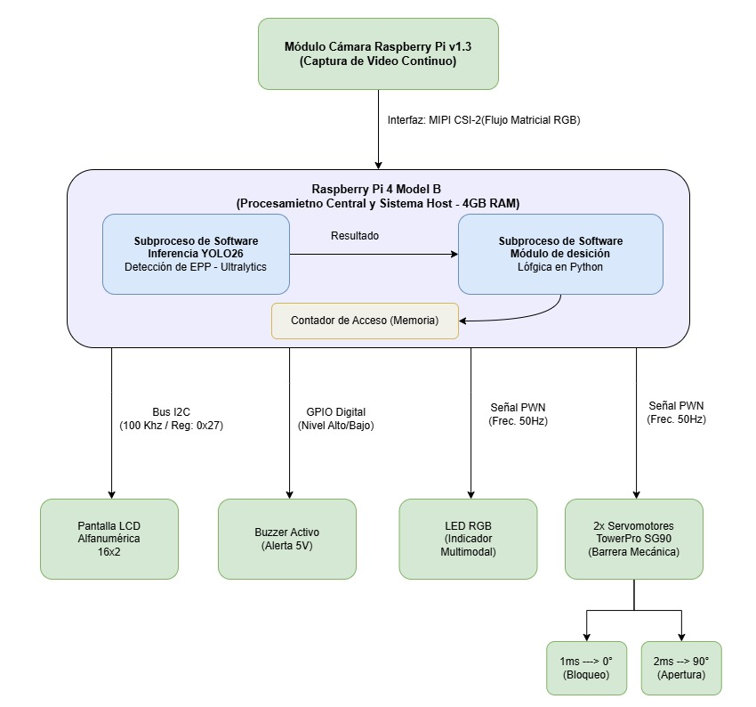
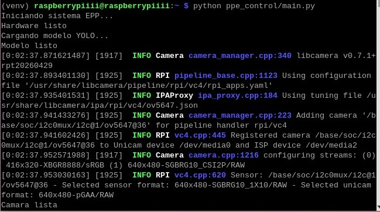
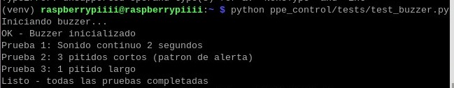
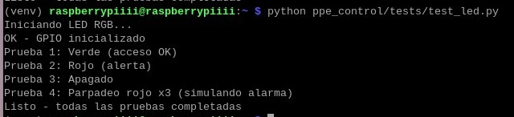
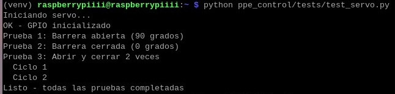
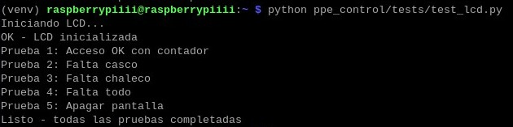

# Sistema Inteligente de Control de Acceso mediante Detección de EPP


## Descripción

Sistema embebido de visión artificial para el control automatizado de acceso mediante la verificación en tiempo real del uso correcto de Equipos de Protección Personal (EPP).

El proyecto utiliza una Raspberry Pi 4 Model B junto con una cámara de video y un modelo YOLOv8 entrenado para identificar cascos y chalecos reflectantes. Cuando un trabajador se posiciona frente a la cámara, el sistema analiza la imagen y determina si cumple con los requisitos de seguridad establecidos: si porta todos los elementos obligatorios, se autoriza el acceso; de lo contrario, se genera una alerta visual y sonora indicando los elementos faltantes.

---

## Objetivos

**General:** Desarrollar un sistema inteligente capaz de verificar automáticamente el uso adecuado de Equipos de Protección Personal mediante técnicas de visión artificial e inteligencia artificial.

**Específicos:**
- Detectar EPP en tiempo real utilizando YOLOv8.
- Automatizar el control de acceso a zonas restringidas.
- Reducir errores asociados a la supervisión manual.
- Proporcionar retroalimentación inmediata al usuario.
- Implementar una solución de bajo costo basada en hardware embebido.

---

## Capturas del Proyecto

---
### Sistema Completo



---
---
### Detección de EPP en Tiempo Real




---

### Acceso Permitido / Acceso Denegado

| Acceso Permitido | Acceso Denegado |
|:---:|:---:|
|  |  |
|  |  |

---

## Funcionamiento General

1. El trabajador se posiciona frente a la cámara.
2. Se captura un fotograma en tiempo real.
3. YOLOv8 detecta los EPP presentes en la imagen.
4. El sistema verifica los elementos obligatorios (casco y chaleco).
5. Según el resultado:

| Condición | Respuesta del sistema |
|---|---|
| EPP completo | LED verde · apertura de barrera · incremento de contador |
| EPP incompleto | LED rojo · activación de buzzer · mensaje en LCD con elementos faltantes |

---

## Arquitectura del Sistema

### Hardware

```
                     ┌──────────────┐
                     │    Cámara    │
                     └──────┬───────┘
                            │
                            ▼
                 ┌─────────────────────┐
                 │    Raspberry Pi 4   │
                 │   YOLOv8 + OpenCV   │
                 └──────┬──────────────┘
                        │
        ┌───────────────┼────────────────┐
        ▼               ▼                ▼
    LED RGB         LCD 16x2          Buzzer
        │
        ▼
   Servomotor → Apertura de barrera
```

### Software

El sistema está organizado en módulos independientes para facilitar el mantenimiento y la escalabilidad.

#### Captura de video (`main.py`, `config.py`)

Inicializa la cámara mediante Picamera2, captura fotogramas en tiempo real y los convierte al formato requerido por OpenCV.

```python
picam2 = Picamera2()
cam_config = picam2.create_preview_configuration(
    main={"size": (config.CAM_ANCHO, config.CAM_ALTO)}
)
picam2.configure(cam_config)
picam2.start()

frame = picam2.capture_array()
frame = cv2.cvtColor(frame, cv2.COLOR_RGB2BGR)
```

#### Detección de EPP (`main.py`, `config.py`)

Carga el modelo YOLOv8 entrenado y ejecuta inferencias sobre cada fotograma. Las clases detectadas se agrupan para contemplar distintas etiquetas generadas durante el entrenamiento.

```python
model = YOLO(config.MODELO_DIR, task="detect")
results = model(frame, imgsz=config.IMGSZ, conf=config.CONFIANZA)
```

```python
CLASES_CASCO   = ["hardhat", "helmet"]
CLASES_CHALECO = ["safety vest", "vest"]
```

#### Validación y control de acceso (`main.py`, `hardware/`)

Determina si el trabajador porta todos los EPP requeridos y coordina las acciones de hardware. Para evitar cambios de estado causados por detecciones erróneas, se emplea un mecanismo de confirmación por fotogramas consecutivos.

```python
epp_completo = casco_detectado and chaleco_detectado

if frames_sin_epp >= config.FRAMES_CONFIRMACION:
    estado_actual = "ALERTA"
elif frames_con_epp >= config.FRAMES_CONFIRMACION:
    estado_actual = "OK"
```

#### Configuración (`config.py`)

Centraliza todos los parámetros del sistema: resolución de cámara, modelo YOLO, clases de EPP válidas y pines GPIO. Modificar este archivo no requiere alterar la lógica principal.

```python
CAM_ANCHO = 416
CAM_ALTO  = 320
CONFIANZA = 0.4
IMGSZ     = 416
```

#### Módulo de hardware (`hardware/gpio.py`, `hardware/lcd.py`)

Gestiona el LED RGB, el buzzer, el servomotor y la pantalla LCD a través de los pines GPIO de la Raspberry Pi.

| Dispositivo | Función |
|---|---|
| LED RGB | Indicar acceso permitido (verde) o denegado (rojo) |
| Buzzer | Emitir alerta sonora |
| Servomotor | Apertura y cierre de la barrera |
| LCD 16×2 | Mostrar mensajes de estado y EPP faltantes |

---

## Estructura del Proyecto

```
FINAL-PROJECT-CV/
├── hardware/
│   ├── __init__.py
│   ├── gpio.py
│   └── lcd.py
├── images/
├── logs/
├── tests/
│   ├── __init__.py
│   ├── test_buzzer.py
│   ├── test_gpio.py
│   ├── test_integracion.py
│   ├── test_lcd.py
│   ├── test_led.py
│   └── test_servo.py
├── config.py
├── main.py
└── README.md
```

---

## Pruebas de Hardware

Cada componente físico dispone de un script de prueba independiente ubicado en la carpeta `tests/`. Estas pruebas permiten validar el funcionamiento de cada dispositivo antes de ejecutar el sistema completo.

| Componente | Script | Ejecución |
|---|---|---|
| Buzzer | `test_buzzer.py` | `python tests/test_buzzer.py` |
| LED RGB | `test_led.py` | `python tests/test_led.py` |
| Servomotor | `test_servo.py` | `python tests/test_servo.py` |
| LCD 16×2 | `test_lcd.py` | `python tests/test_lcd.py` |

### Buzzer



### LED RGB



### Servomotor



### LCD 16×2



**Resultados esperados:**
- El buzzer emite los patrones de sonido programados (continuo, pitidos cortos y prolongado).
- El LED RGB alterna entre verde, rojo y apagado.
- El servomotor abre y cierra la barrera sin bloqueos.
- La pantalla LCD muestra correctamente los mensajes de acceso y alerta.

---

## Bibliotecas Utilizadas

| Biblioteca | Función |
|---|---|
| Ultralytics | Implementación de YOLOv8 |
| OpenCV | Procesamiento de imágenes |
| NumPy | Operaciones matemáticas |
| RPi.GPIO | Control de pines GPIO |
| gpiozero | Gestión simplificada de hardware |
| smbus2 | Comunicación I2C (LCD) |
| Pillow | Procesamiento de imágenes auxiliar |
| Picamera2 | Captura de video desde cámara Raspberry Pi |

---

## Instalación

### 1. Clonar el repositorio

```bash
git clone https://github.com/ariel101/final-project-cv.git
cd final_project-cv
```

### 2. Crear entorno virtual

```bash
# Linux
python3 -m venv venv
source venv/bin/activate

# Windows
python -m venv venv
venv\Scripts\activate
```

---

## Configuración

### Modelo entrenado

El modelo YOLOv8 no está incluido en el repositorio por su tamaño. Antes de ejecutar el sistema, configure su ruta en `config.py`:

```python
MODEL_DIR = "/home/raspberrypiii/best26_ariel_ncnn_model/"
```

La estructura esperada del directorio del modelo es:

```
best26_ariel_ncnn_model/
├── model.ncnn.bin
├── model.ncnn.param
└── metadata.yaml
```

### Pines GPIO

Modifique los pines en `config.py` según la conexión física utilizada:

```python
LED_VERDE = 27
LED_ROJO  = 17
BUZZER    = 18
SERVO     = 12
```

---

## Ejecución

```bash
python main.py
```

Al iniciar, el sistema cargará la cámara, el modelo YOLOv8 y comenzará la detección en tiempo real con control de acceso activo.

---

## Componentes de Hardware

- Raspberry Pi 4 Model B
- Cámara USB o Raspberry Pi Camera
- Pantalla LCD 16×2 con interfaz I2C
- Servomotor SG90
- Buzzer activo
- LED RGB de cátodo común
- Fuente de alimentación 5V
- Cables Dupont

---

## Mejoras Futuras

- Reconocimiento facial para identificación de trabajadores.
- Registro de accesos en base de datos.
- Panel web con estadísticas de uso.
- Almacenamiento de evidencias fotográficas.
- Notificaciones por Telegram o correo electrónico.
- Integración con sistemas de control industrial.

---

## Autores

**Vidaurre Mejia Christian Paul** · **Cayo Vargas Ariel Nelzon** · **Cepeda Alvaro Sebastian** · **Laime Marco**

Universidad Mayor Real y Pontificia de San Francisco Xavier de Chuquisaca — Ingeniería en Ciencias de la Computación · Gestión 01-2026

---

## 📄 Licencia y Créditos

Este proyecto fue desarrollado con fines académicos, educativos y de investigación.

El código fuente puede ser modificado, reutilizado y adaptado citando a los autores originales del proyecto.

### 📦 Dataset Utilizado

El modelo de detección de Equipos de Protección Personal (EPP) fue entrenado utilizando como base el dataset **Construction PPE Dataset** publicado en Roboflow Universe.

**Dataset:**
https://universe.roboflow.com/gaos-workspace/construction-ppe-qofi4

Agradecemos a los autores y colaboradores del conjunto de datos por facilitar recursos que contribuyen al desarrollo de soluciones de visión artificial aplicadas a la seguridad laboral.

---

